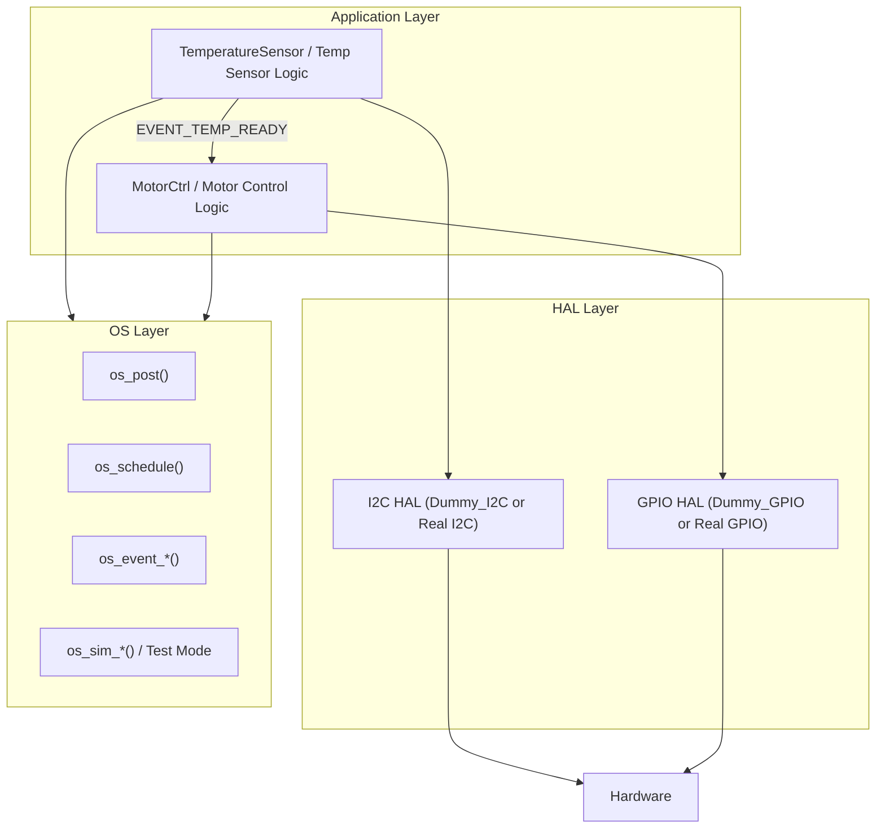

```mermaid
flowchart TD

    subgraph APP["Application Layer"]
        TS["TemperatureSensor / Temp Sensor Logic"]
        MC["MotorCtrl / Motor Control Logic"]
    end

    TS -->|EVENT_TEMP_READY| MC

    subgraph HAL["HAL Layer"]
        I2C["I2C HAL (Dummy_I2C or Real I2C)"]
        GPIO["GPIO HAL (Dummy_GPIO or Real GPIO)"]
    end

    TS --> I2C
    MC --> GPIO

    subgraph OS["OS Layer"]
        POST["os_post()"]
        SCHED["os_schedule()"]
        EVENT["os_event_*()"]
        SIM["os_sim_*() / Test Mode"]
    end

    TS --> OS
    MC --> OS

    I2C --> HW["Hardware"]
    GPIO --> HW
```