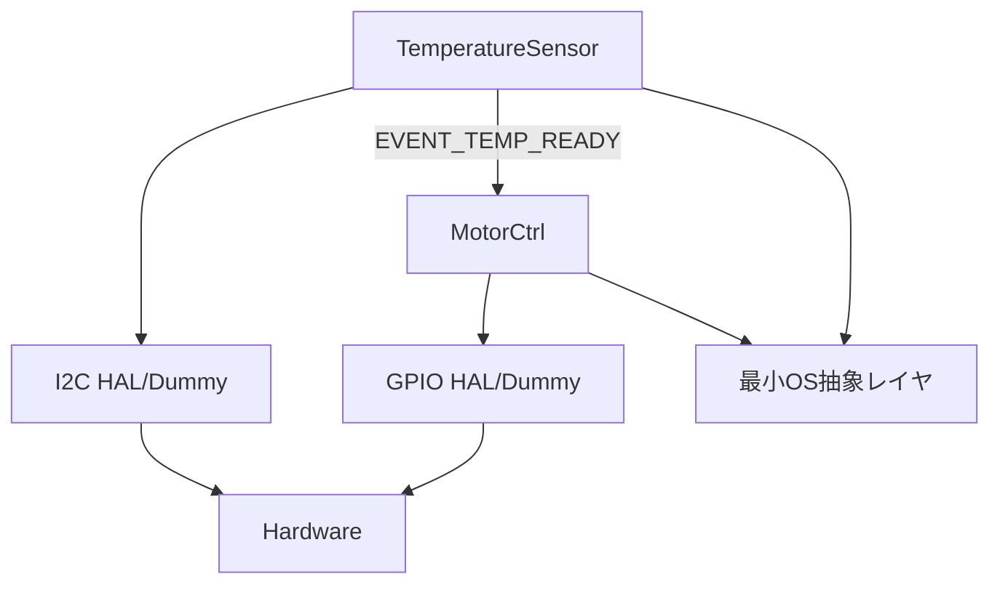

```mermaid
flowchart TD
    A[TemperatureSensor] -->|EVENT_TEMP_READY| B[MotorCtrl]
    A --> C[I2C HAL/Dummy]
    B --> D[GPIO HAL/Dummy]
    D --> G[Hardware]
    C --> G
    A --> F[最小OS抽象レイヤ]
    B --> F
```