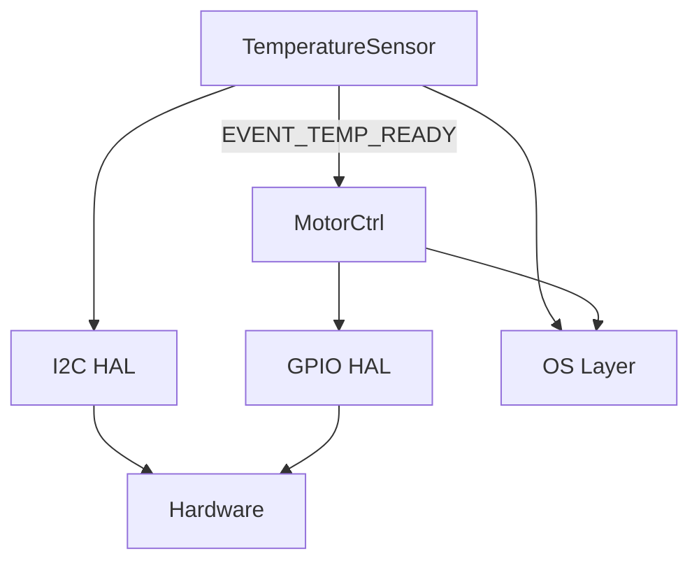

```mermaid
flowchart TD
    A[TemperatureSensor] -->|EVENT_TEMP_READY| B[MotorCtrl]
    A --> C[I2C HAL]
    B --> D[GPIO HAL]
    C --> E[Hardware]
    D --> E
    A --> F[OS Layer]
    B --> F
```