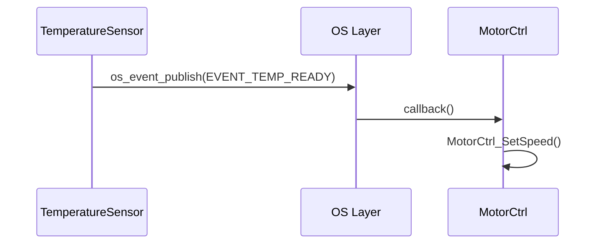

```mermaid
sequenceDiagram
    participant TS as TemperatureSensor
    participant OS as OS Layer
    participant MC as MotorCtrl

    TS->>OS: os_event_publish(EVENT_TEMP_READY)
    OS->>MC: callback()
    MC->>MC: MotorCtrl_SetSpeed()
```